# D12

### 1. Soal 1
Sebutkan web server yang digunakan pada "monta.if.its.ac.id"! 

#### Jawaban
Cara untuk mendapatkan web server yang digunakan pada situs di atas adalah dengan meng-capture paket-paket terlebih dahulu, mengakses monta.if.its.ac.id, stop capture, lalu pada display filter kita gunakan filter “tcp contains monta” sehingga didapat seperti gambar di bawah. 
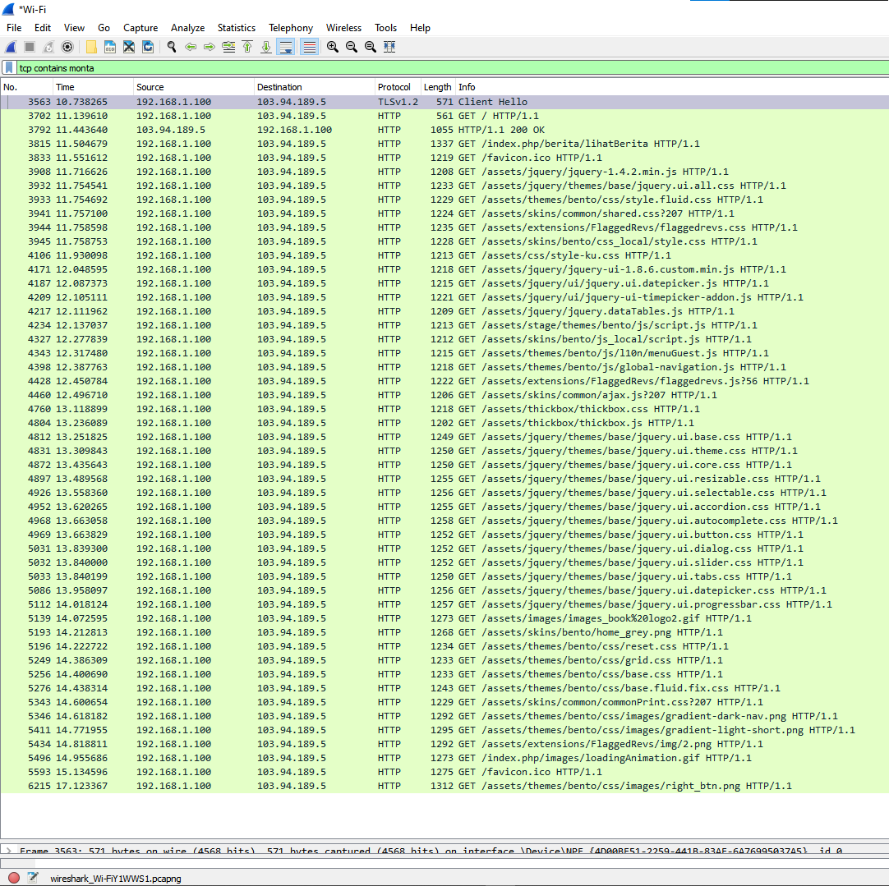

### 2. Soal 2
Ishaq sedang bingung mencari topik ta untuk semester ini , lalu ia datang ke website monta dan menemukan detail topik pada website “monta.if.its.ac.id” , judul TA apa yang dibuka oleh ishaq ?

#### Jawaban
Kita akan mencari detail link yang diakses oleh Ishaq sehingga pada display filter kita menerapkan filter “http.request.uri contains "detail"” sehingga didapat hasil seperti di bawah.
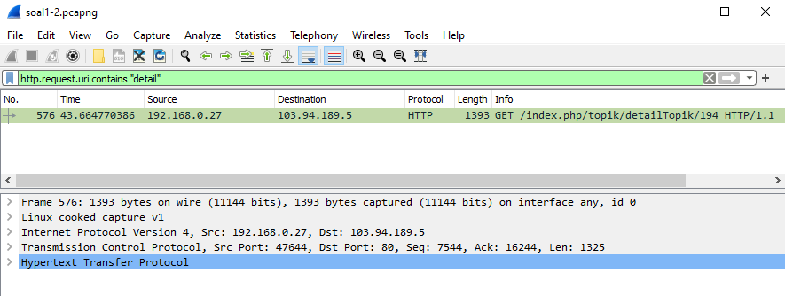

Klik pada hasil capture paket untuk melihat detailnya didapat link yang diakses adalah http://monta.if.its.ac.id/index.php/topik/detailTopik/194. 
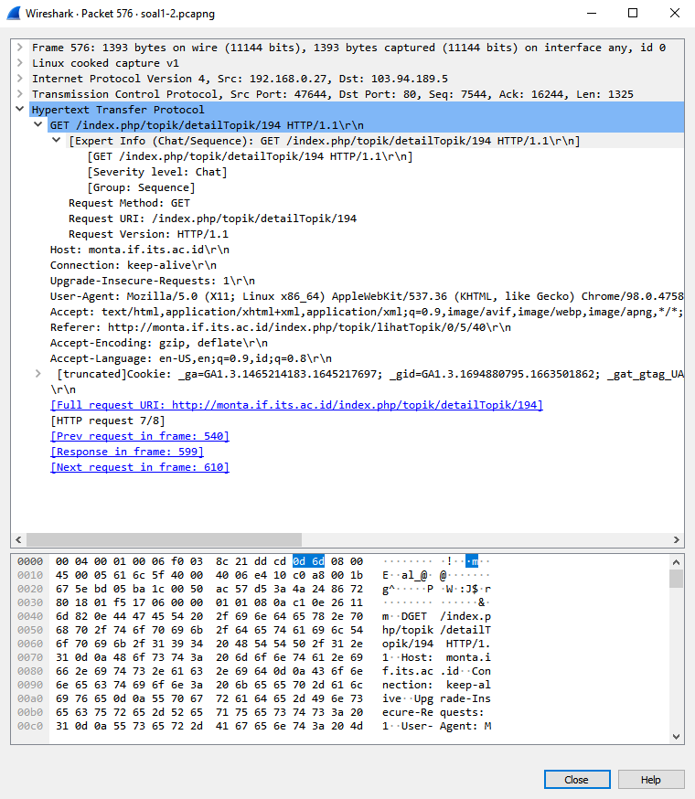

Ketika link tersebut diakses, muncul judul ta yang dibuka oleh Ishaq adalah “Topik Tugas Akhir”.
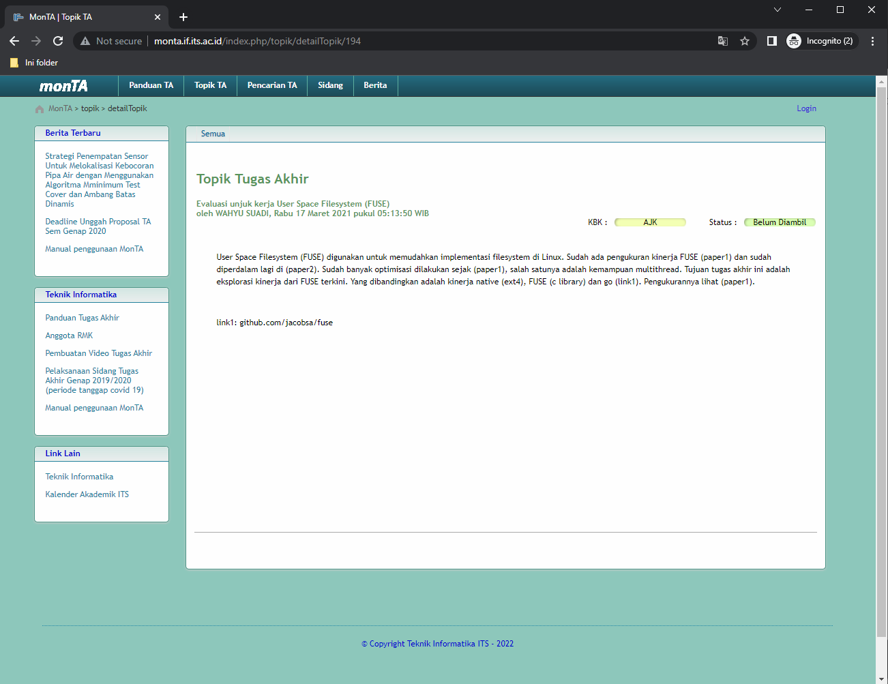

### 3. Soal 3
Filter sehingga wireshark hanya menampilkan paket yang menuju port 80! 

#### Jawaban
Menggunakan display filter tcp.dstport == 80
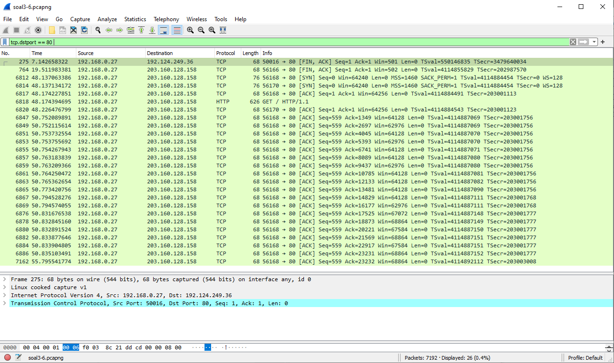

### 4. Soal 4
Filter sehingga wireshark hanya mengambil paket yang berasal dari port 21!

#### Jawaban

Menggunakan capture filter `src port 21`
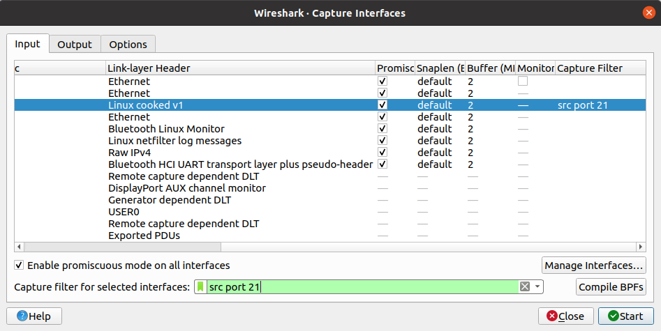

### 5. Soal 5
Filter sehingga wireshark hanya mengambil paket yang berasal dari port 443!

#### Jawaban

Menggunakan capture filter `src port 443`

### 6. Soal 6
Filter sehingga wireshark hanya menampilkan paket yang menuju ke lipi.go.id

#### Jawaban

Menggunakan display filter `http contains lipi.go.id`
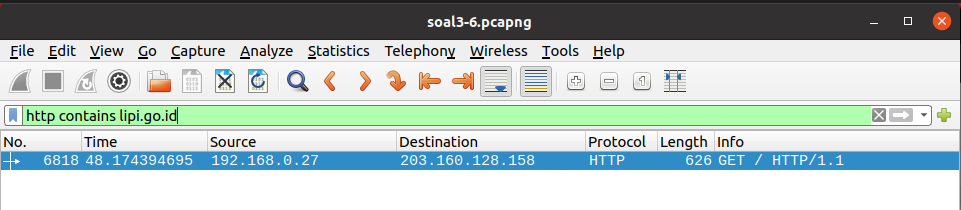

### 7. Soal 7
Filter sehingga wireshark hanya mengambil paket yang berasal dari ip kalian!

Buka cmd dan tuliskan ` ipconfig ` 

Selanjutnya pilih IPv4 sesuai dengan source yang mau ditangkap, saya memilih wi-fi

Selanjutnya memasukkan argument ke capture filter wireshark, yaitu ` ip src (ip anda) `

Berikut adalah hasilnya

### 8. Soal 8
Buka file ` soal8-10.pcapng ` dan tulis argumen ` tcp ` ke dalam display filter

Kemudian klik kanan pada salah satu packet dan pilih follow -> tcp stream

Hasilnya adalah sebagai berikut

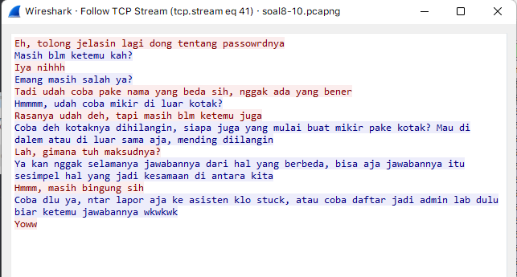

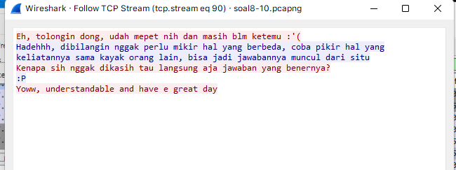

### 9. Soal 9
Terdapat laporan adanya pertukaran file yang dilakukan oleh kedua mahasiswa dalam percakapan yang diperoleh, carilah file yang dimaksud! Untuk memudahkan laporan kepada atasan, beri nama file yang ditemukan dengan format [nama_kelompok].des3 dan simpan output file dengan nama “flag.txt”.

Dari percakapan bisa diambil bahwa file dikirim melalui port 9002. Memasukkan argumen ke dalam display filter tcp.port == 9002
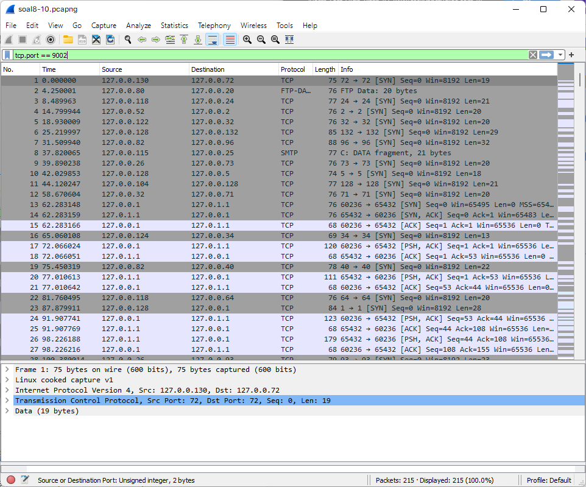

Kemudian klik kanan dari salah satu packet, follow -> tcp stream akan didapatkan sebagai berikut
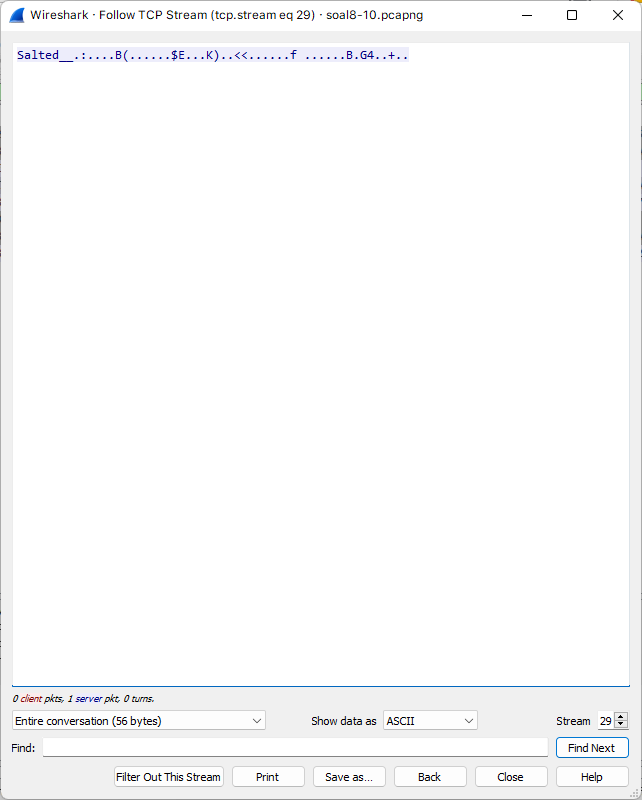

Kemudian pilih show data as raw dan save file dengan [nama kelompok].des3 (D12.des3)

Setelah disimpan dengan format raw, file kemudian didecode melalui openssl sebagai berikut 
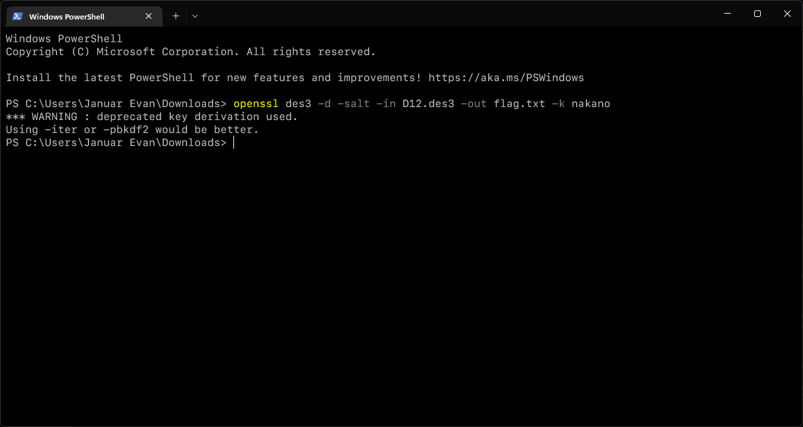

### 10. Soal 10
Temukan password rahasia (flag) dari organisasi bawah tanah yang disebutkan di atas!
JaRkOm2022{8uK4N_CtF_k0k_h3h3h3}
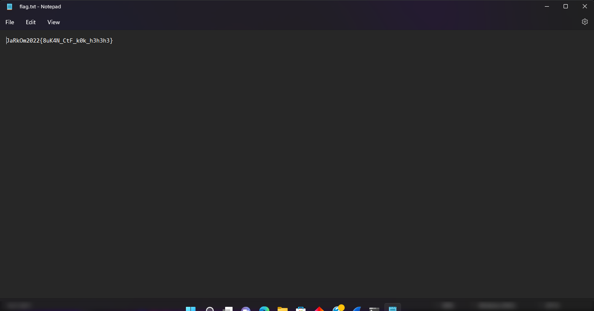

## Kendala Yang Dialami
1. saat mendecode file hasil dari wireshark
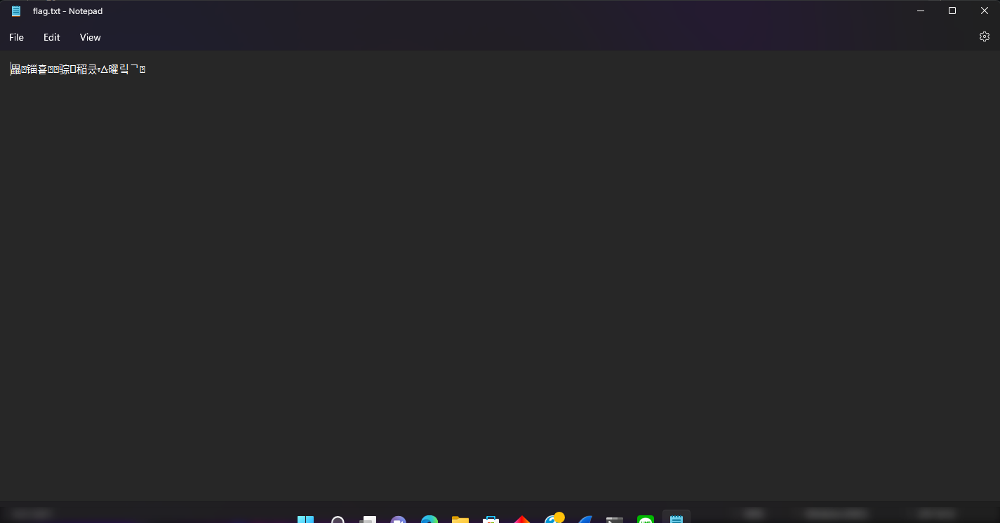
