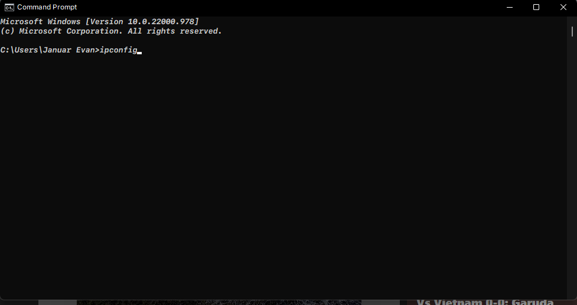
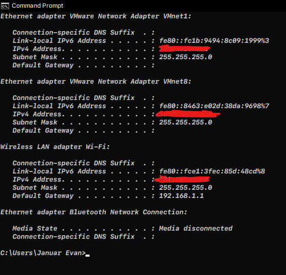
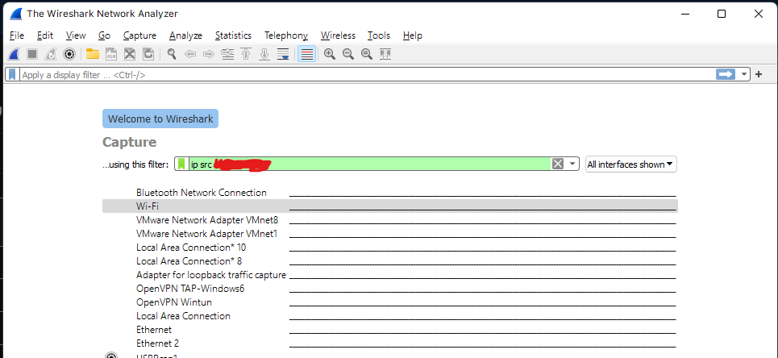
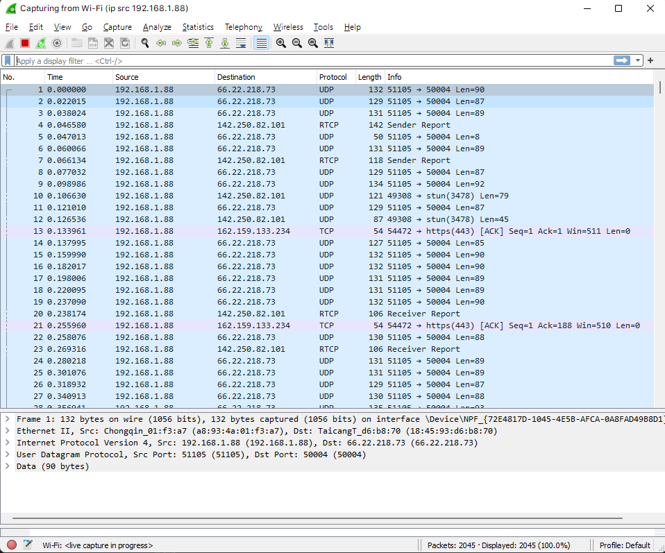
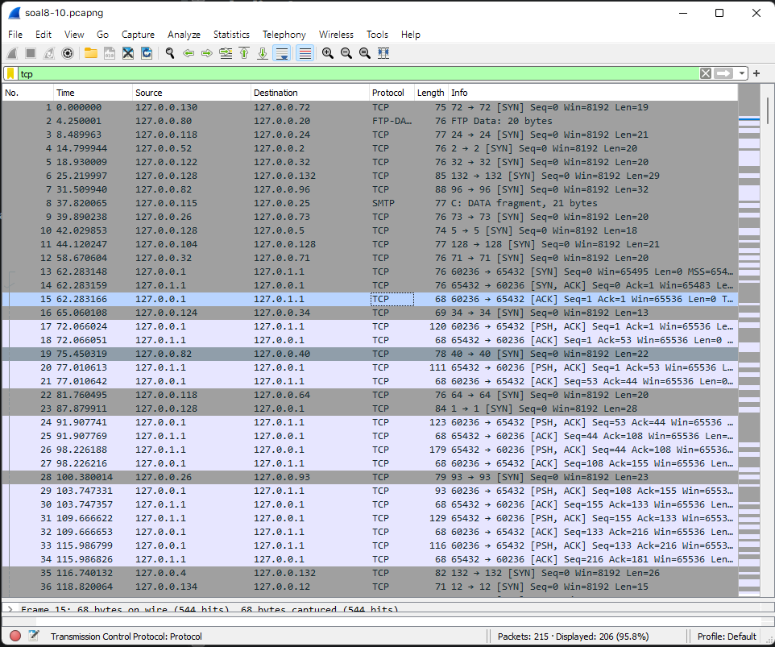
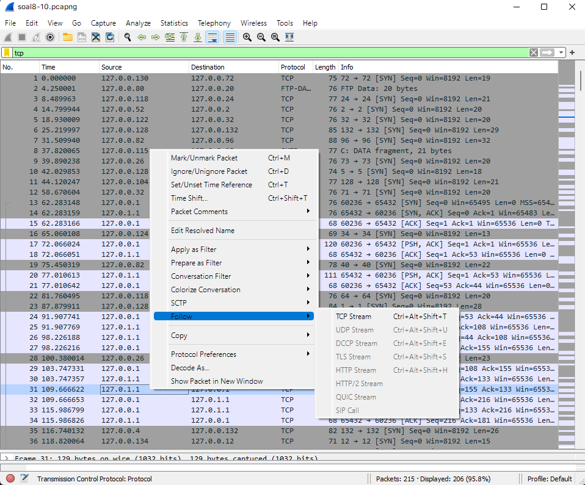
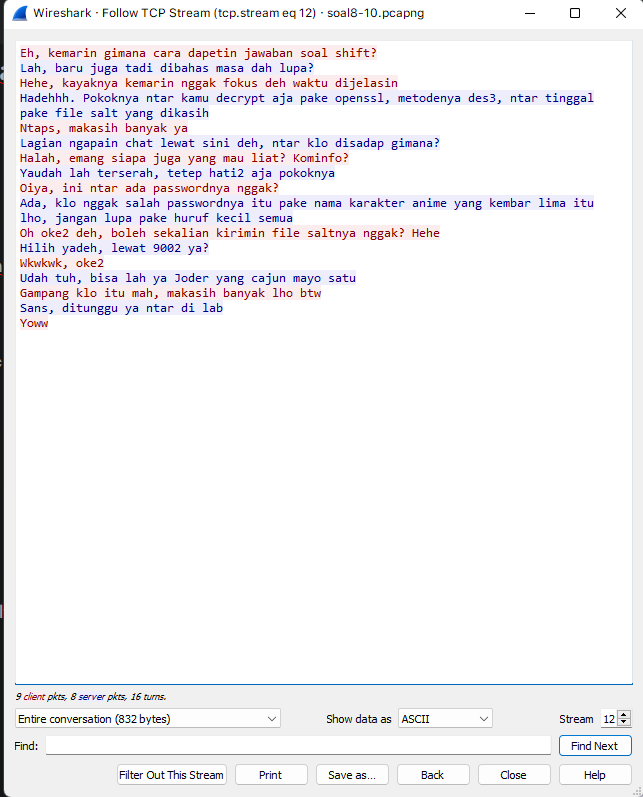

# D12

1.
2.
3.
### 4. Soal 4
Filter sehingga wireshark hanya mengambil paket yang berasal dari port 21!

#### Jawaban

Menggunakan display filter `tcp.srcport == 21`

### 5. Soal 5
Filter sehingga wireshark hanya mengambil paket yang berasal dari port 443!

#### Jawaban

Menggunakan display filter `tcp.srcport == 443`

### 6. Soal 6
Filter sehingga wireshark hanya menampilkan paket yang menuju ke lipi.go.id
#### Jawaban

Menggunakan display filter `tcp.srcport == 443`

### 7. Filter sehingga wireshark hanya mengambil paket yang berasal dari ip kalian!

Buka cmd dan tuliskan ` ipconfig ` 

Selanjutnya pilih IPv4 sesuai dengan source yang mau ditangkap, saya memilih wi-fi

Selanjutnya memasukkan argument ke capture filter wireshark, yaitu ` ip src (ip anda) `

Berikut adalah hasilnya

8.
Buka file ` soal8-10.pcapng ` dan tulis argumen ` tcp ` ke dalam display filter

Kemudian klik kanan pada salah satu packet dan pilih follow -> tcp stream

Hasilnya adalah sebagai berikut

9.
10.
